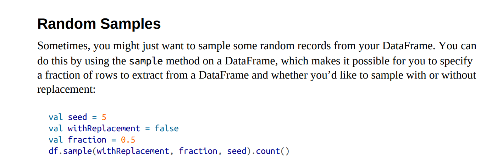

## EMR Project3
### Purpose of this repo
Share code that is to be run on EMR. This can include jobs to be run on behalf of the class, examples that you've found useful and would like to share, or anything else you think is appropriate.

If anyone is interested in collaborating, shoot me your GitHub handle on Discord and I'll add you as an admin to this repo.

### EMR Goals
- Sample the common crawl datasets to produce a smaller, more manageable datasets that everyone can individually download and run queries on locally

- I'm going to start by focusing on the columnar index because I've already spent some time thinking about it and working with it

- As per conversation with the class, I'll initially focus on columns 'url_host_name', 'url_path', and 'url_host_tld'

- If someone would like to get started working the main index and share their work here,  please feel free

- TODO: add more goals

### Todo
- Run practice jobs on EMR to get familiar

- Research and think about the best way to sample these datasets. Are strategies for sampling columnar structured data different from conventionally structured data?

- Attempt to query Common Crawl data from EMR

- Find out who to talk to about running medium-large sized jobs on Revature's EMR cluster. (I've already sent Adam a message about this)

### Resources

The simplest EMR hello world you could ask for:

https://www.youtube.com/watch?v=gOT7El8rMws&t=287s&ab_channel=JohnnyChivers

Adam's EMR template:

https://github.com/AdamDKing/210104-usf-bigdata/tree/main/week5/emrtemplate

Mini-primer on sampling a DataFrame in Spark:

